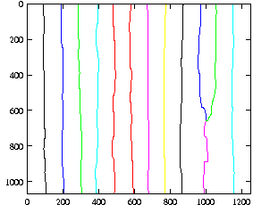
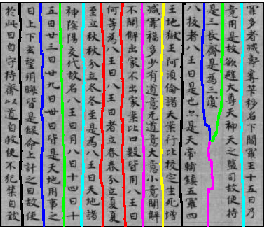

======
fig.py
======

.. contents::

Here, I provide a python module containing an object-oriented
interface to XFig_ documents.  (Conceptually, some kind of DOM.)

For example, imagine you have the following `example file
<test.fig>`_ ``test.fig``, created by Gnuplot:

Now you can simply load the file, examine and process it, for example
to add a `background image <background.jpg>`_ like this:

.. code-block:: python

  >>> import fig
  >>> f = fig.File("test.fig")
  >>> f.layers() # check which layers exist
  [0, 10]
  >>> f.layer(0)                                   # doctest: +ELLIPSIS
  [<fig.Text object at ...>, <fig.Text object at ...]
  >>> len(f.layer(0)) # layer 0 has only Text objects with the numbers..
  13
  >>> f.layer(0).remove() # ..which we want to remove
  >>> for polyLine in f.layer(10):
  ...     if len(polyLine.points) == 2:
  ...         polyLine.depth = 99
  ...     elif len(polyLine.points) == 5:
  ...         polyLine.depth = 20
  ...         bgRect = polyLine
  ...
  >>> len(bgRect.points) # unfortunately, Gnuplot draws a closed border..
  5
  >>> bgRect.closed() # ..but saves it as an open XFig object
  False
  >>> b = bgRect.bounds() # determine size of plot region
  >>> bgImage = fig.PictureBBox(b.x1, b.y1, b.x2, b.y2, "background.jpg")
  >>> bgImage.depth = 50 # you can set any other properties like this
  >>> f.append(bgImage) # and add new objects to the document
  >>> f.landscape # finally, we change some document properties
  True
  >>> f.landscape = False
  >>> f.paperSize
  'Letter'
  >>> f.paperSize = "A4"
  >>> f.metric = True
  >>> f.save("processed.fig")
  'processed.fig'

The true killer feature is the findObjects_ function:

.. code-block:: python

  f.findObjects(depth = 20)
  f.findObjects(type = fig.Polyline)
  # all conditions must be fulfilled:
  f.findObjects(lineWidth = 10, depth = 100)
  # for disjunctive conditions, use list concatenation:
  f.findObjects(depth = 10) + f.findObjects(depth = 20)
  # dito., using the layer() shortcut for findObjects(depth = ..):
  f.layer(10) + f.layer(20)

What's so useful about that is that it returns an ObjectProxy_,
which is also a Container_ (and thus a Python ``list``), so you can
do all kinds of cool things.  The most fancy thing is that you can set
a property on all objects within the proxy - this is most similar to
the "update" tool in XFig, which sets a property on all objects within
a group.  Again, this is our example from above:

.. code-block:: python

  >>> import fig
  >>> f = fig.File("processed.fig")
  >>> f.findObjects(type = fig.Polyline).layers()
  [10, 20, 99]
  >>> f.layer(10).lineWidth = 3
  >>> f.save() # save under same filename
  'processed.fig'

Finally, you can also easily export the final File_ to other formats
via fig2dev_:

.. code-block:: python

  >>> f.save(fig2dev="png")
  'processed.fig'

This produces the following ``processed.png``:

.. _File: apidox/fig.File-class.html
.. _findObjects: apidox/fig.Container.findObjects-class.html
.. _ObjectProxy: apidox/fig.ObjectProxy-class.html
.. _Container: apidox/fig.Container-class.html
.. _fig2dev: apidox/fig.File.fig2dev-class.html

Download
========

You can download the last release of ``fig.py`` here:

.. download:: software/figpy/fig.py

I plan to eventually split the module into several ones, wrap them in
a Python package and provide a setuptools-based installer for a more
proper release.

You can also access my `mercurial repository`__ online or check it out
as follows::

  hg clone http://www.informatik.uni-hamburg.de/~meine/hg/figpy/

__ http://www.informatik.uni-hamburg.de/~meine/hg/figpy/

Documentation
=============

The `API documentation <apidox>`_ is not perfect, but should be useful
at least.  Unfortunately, there is no way (until python 2.4 at least)
to document the properties (slots) of the objects (which would be very
important for ``fig.py``).

I don't like the large list of module "variables" either, which are in
fact enum-like constants.

.. _epydoc: http://epydoc.sourceforge.net
.. _tell me: hans_meine@gmx.net

ChangeLog
---------

If you want to check which version you have, it can be queried like this:

.. code-block:: python

   >>> import fig
   >>> fig.__version__
   ['1209', '2007-11-14', '15:31:54Z']

The following is a short list of recent user-visible or important
changes (I marked only changes in bold which I guess someone might
have used before):

Version 1209 (2007-11-14):
  - **API-Change**: combine "x" and "y" properties of Text objects to "pos"

Version 971 (2007-09-15):
  - rename ``shapeFactors`` property to ``_shapeFactors`` (instead,
    ``shapeFactors`` is now a method which will return default shape
    factors for ApproximatedSpline and InterpolatedSpline objects)

Version 909 (2007-08-28):
  - **API-Change**: remove File.saveEPS (use ``save(fig2dev="eps")`` instead)
  - change return value of File.save() if fig2dev was given

Version 899 (2007-08-27):
  - correctly (un)escape special characters (e.g. "(c)") inside Text objects

Version 891 (2007-08-27):
  - rename ``fontAngle`` property to ``angle``

Version 877 (2007-08-24):
  - improve ArcBase API
  - **API-Change**: rename ``pictureFilename`` property to ``filename``

Version 865 (2007-08-16):
  - support for reading and writing comments for objects + whole file
    (thanks to Roman Putanowicz for a first implementation + test file)
  - Compound bounds are no longer stored, but will be calculated on demand
    (pro: automatic updating, con: Text+Spline bounds cannot be correctly
    calculated)
  - copy.deepcopy support for Containers
  - API for creating Arc objects
  - preliminary Vector helper class, and improved Rect class

Version 634 (2007-06-04):
  - let Polyline take list of points as constructor argument
    (consistent with polygon)
  - proper Arrow objects with separated, accessible properties

Version 614 (2007-05-16):
  - rename ``_version`` to ``__version__``

Version 611 (2007-05-11):
  - **API-Change**: renamed ``PolyLine`` to ``Polyline`` for consistency
  - much better docstrings (for epydoc-generated API documentation)

Version 568 (2007-05-02):
  - better spline handling (API, reading, writing)
  - fixed loading of texts that start with spaces (e.g. as saved by Gnuplot)

Version 567 (2007-03-23):
  - fix Polygon point handling on file read (broken by v561)

Version 561 (2007-03-09):
  - default to portrait, not landscape mode
  - check whether changeType() changes an open into a closed poly
    and remove the last point then

Bugs / Missing Features
-----------------------

Currently, only the following things may change when loading & saving
the same file:

- Bounding boxes of compounds that contain Text or Spline objects

  * for spline objects, it might be fixable by implementing complete
    X-spline support (hard, but not impoosible)

  * text bounds depend on font etc. which are very hard
    to support in fig.py without a complete Postscript font database

- the "direction" flag of ellipses/circles (don't know what this is
  about, it's the 11th column of ellipse objects) may change from 0 to 1

- the display of floating point values (number of trailing zeros)

- capitalization of "portrait" etc. in the file header (e.g. Gnuplot
  and XFig disagree on "Flush left")

- some irrelevant spacing (XFig starts lines with "<tab><space>", I am
  purposely leaving the "<space>" out)

- An extended version comment like "Produced by xfig version
  3.2.5-alpha5" in the first line.

Everything else would be considered a bug (or added to the above
list).  You can check whether your particular file would change - to
make sure that no data is lost - by using the command ::

  python -m fig yourfile.fig

(Formatting changes are purposely not displayed.)

Example Scripts
===============

In the following, I offer some more simple example scripts using the
above ``fig.py`` module.

{software/figpy/figdep}

figdep
------

The script ``figdep`` is useful for generating dependency files to be
included in Makefiles; e.g. to automatically regenerate your EPS/PDF
files from the ``.fig`` ones if an included image has changed.

  USAGE: ./figdep <infile1> [<infile2> ...]

{software/figpy/fig2tikz}

fig2tikz
--------

This is a neat little conversion tool that transforms your XFig_ files
into TikZ_ latex commands.  I recently added some commandline options,
but they are still subject to change.  As an example, just call it
like this::

  # fig2tikz myfile.fig > myfile.tikz

The resulting ``myfile.tikz`` will contain a complete ``tikzpicture``
environment, which you can include from LaTeX with
``\input{myfile.tikz}``.  There are two conflicting design goals:

1. create code that leads to the same appearance
   (e.g. add lots of attributes like "line width" etc.)

2. create "minimal" code that tries to reflect as much of the
   intention of the graphic as possible (i.e. transform coordinates,
   ideally recognize anchors / connections between elements)

The latter is more important to me; I am trying to add commandline
options for user-configurable balancing between the two in case of
conflicts.  It already supports ``--appearance``, which lets it put
emphasis on the first of the two above options.

Currently, fig2tikz supports:

* object types:

  - ellipses (no angle support yet) and circles
  - polygons (open + closed)
  - boxes / rectangles and  arc boxes (round corners)
  - picture boxes
  - arcs (open & closed, clockwise & CCW)
  - text objects (incl. font size, rotation, hidden, rigid, and special flags)
  - splines (problem with arrow heads, curve not equivalent, see below)

* object comments (not compound comments, since compounds are not
  represented in the output, see below)

* line and fill colors

  - incl. "default" color, i.e. no explicit setting
  - suppression of repeating color re-definitions
  - translation of first 8 default named colors
  - fill shades (black..fill color..white, using PGF !percent syntax)
  - using draw, fill, or filldraw commands instead of path[draw/fill=..]

* line properties

  - line widths (1 is interpreted as "default", i.e. no explicit setting)
  - line styles: dashed, dotted, solid/default
  - cap and join styles (round, miter, ...)
  - arrows (alas, no 100% match)

* Zapf DingBats (needs pifont package)
* LaTeX font styles/shapes (italic, bold, etc.)

Planned / missing features:

* rotated ellipses
* flipped images
* more fonts, especially Greek letters
* use pgf[declare|use]image instead of includegraphics
* more line styles, e.g. dash-dot etc.
  (purposely left out for now -- distances are different anyhow)
* fill patterns (striped, etc.)
* separate conversion and output, building an in-memory representation first

  - don't close and re-open paths so often
  - common options in scopes or in the figure environment
  - transform compound objects into scopes?
    (would not work if several compounds span the same layers)
  - recognize text-inside-(arc)boxes and transform them into nodes

* splines do not look the same (X-spline model different from what TikZ uses)
* arrow heads on splines have the wrong orientation (TikZ bug AFAICS)
* arrow heads have the wrong color (this is a regression due to more
  conservative color setting that will be fixed again soon)

Note that fig2tikz is *much* more powerful than the outdated,
obviously unmaintained `fig2pgf
<http://pgf.cvs.sourceforge.net/pgf/fig2pgf/>`_, which is available
via the PGF CVS repository, ever was.

.. _TikZ: http://sourceforge.net/projects/pgf/

{software/figpy/mergeFigs}

mergeFigs
---------

This is another very simple, small script which merges two files.
(Yes, it does a little more than just concatenating the contents, like
handling custom color definitions.)

  USAGE: ./mergeFigs <infile1> <infile2> [outfile]

{software/figpy/extractLayers}

extractLayers
-------------

  USAGE: ./extractLayers <infile1> <layers> [<layers> ...]
    where <layers> may be for example "10-50", "30-", "1,25"

I used this script for creating animations from XFig_ files with
``Makefile``-rules like the following (yes, these examples are rather
complicated ones, it gets more simple if you have less animation
frames)::

  %.eps: %.fig
  	fig2dev -L eps $< $@

  house-XPMap_pres_1.fig: house-XPMap_pres.fig
  	extractLayers $< 45- 39-45,50- 26,41-45,50- 23-25,41-45,50- 20,25,41-45,50-

  scaniter_pres_1.fig: scaniter_pres.fig
  	extractLayers $< 42,45,50,52,100 {20,21,22,23,24,25,26,27,28,29},100 43-51 {10,11,12,13,14},100

BTW: If you have the problem that your resulting EPS files have
different sizes (bounding boxes), try adding an invisible rectangle
(line width 0, no filling) behind everything and always extract that
layer to all frames (IIRC the layer 100 in the ``scaniter`` example was
sth. like that).

.. _XFig: http://www.xfig.org/

{software/figpy/dimFig}

dimFig
------

This script creates a dimmed / grayed-out version of an XFig file
(e.g. for use with PGF/Beamer).

  USAGE: ./dimFig <infile> <bgcolor> <opacity>
    where `bgcolor` is the background color in the usual hex notation
    (e.g. #ffffff for white), and opacity is the percentage as
    specified in the colormixin-environment (e.g. 15 in the beamer
    themes I used).

The input filename may be '-' for stdin, and if no output
filename is given, the output will be sent to stdout.

In LaTeX, you can use ``\colorcurrentmixin`` to get the correct
arguments values matching the effect applied to the surrounding text.

For example, I have used this script together with the following
Makefile rule for preparing dimmed versions of my figures for a
presentation::

  %_dimmed.fig: %.fig
      dimFig $< \#ffffff 15 | \
      sed 's,\.\(png\|eps\),_dimmed.\1,' > $@

{software/figpy/fig2pdf}

fig2pdf
-------

This script can be used to prevent embedded low-resolution images from
being converted to JPEGs, which may lead to ugly artifacts.  (I had
evil problems with embedded PNGs which looked fine in EPS but gross
when exported to PDF - directly with fig2dev or after EPS export and
epstopdf conversion.)

``fig2pdf`` implements a safe workaround to this problem: It creates
temporary JPEGs with an increased resolution, such that each 8x8 block
contains exactly one of the original pixels.

  USAGE: ./fig2pdf <infile.fig> [<outfile.pdf>]

``fig2pdf`` needs ``convert`` (ImageMagick) to be installed and in the
PATH, and it uses the subprocess module which comes with Python 2.4 or
later.

.. NOTE::

  Thanks to the big help of `Sven Utcke </~utcke/>`_, I have found out
  the real cause of the problem: Acrobat Distiller 5 supports `lots of
  options`_ that influence how images are embedded in a PDF file, and
  Ghostscript does so, too.  However, in contrast to the commercial
  program, GS does not have a nice GUI that displays these options.
  What's worse, even if you can tell Ghostscript exactly how you want
  it to behave (see Ps2pdf.htm_), it is often called behind the scenes
  (e.g. by fig2dev), and it is then totally unclear (at least to me)
  how to change the settings.  Thus, I locally modified the malicious
  defaults in ``/usr/share/ghostscript/<version>/lib/gs_pdfwr.ps``,
  see `this patch <ghostscript_disable_dct_compression.diff>`_.

.. _Ps2pdf.htm: http://pages.cs.wisc.edu/~ghost/doc/AFPL/6.50/Ps2pdf.htm
.. _lots of options: http://pages.cs.wisc.edu/~ghost/doc/AFPL/6.50/Ps2pdf.htm#Options
